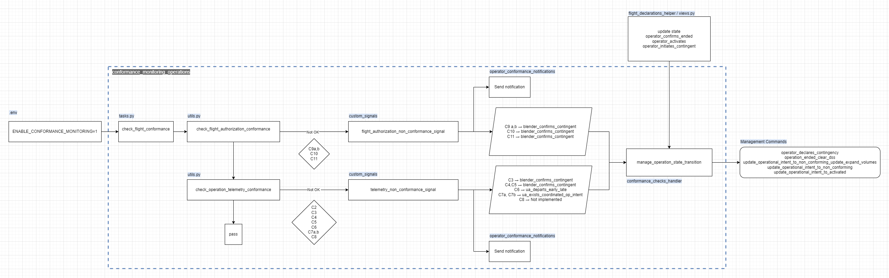

# Operational Flows 

The following flows are enabled in this directory to mimic interactions with GCS:

- **F1** Accepted -> Activated -> (submit telemetry) -> Ended
- **F2** Accepted -> Activated -> (submit telemetry) -> Contingent -> Ended 
- **F3** Accepted -> Activated -> (submit telemetry) -> Non-Conforming (set by Blender) -> Ended
- **F4** Accepted -> Activated -> (submit telemetry) -> Non-Conforming (set by Blender) -> Activated (off-nominal volumes removed) (set by Blender) -> Ended
- **F5** Accepted -> Activated -> (submit telemetry) -> Non-Conforming (set by Blender) -> Contingent -> Ended

# Blender Conformance Monitoring 
The image below shows how the internal mechanism of Flight Blender works in the context of conformance monitoring

